# Design Document: Smart Learning Coach

## Overview

The Smart Learning Coach is a cloud-native, AI-powered educational platform that provides personalized learning experiences for students and beginner developers. The system leverages modern microservices architecture built with FastAPI, integrates with Large Language Models for intelligent content generation, and employs data-driven algorithms to create adaptive learning paths.

The platform transforms traditional static learning into dynamic, personalized experiences by analyzing learner goals, assessing current skill levels, and generating customized roadmaps with weekly task breakdowns. The system continuously adapts based on learner progress and feedback, providing an AI mentor experience that guides users through their educational journey.

## Architecture

### High-Level Architecture

The Smart Learning Coach follows a microservices architecture pattern with clear separation of concerns, enabling independent scaling and deployment of different system components.

```mermaid
graph TB
    subgraph "Client Layer"
        WEB[Web Frontend]
        API_GW[API Gateway]
    end
    
    subgraph "Application Services"
        AUTH[Authentication Service]
        GOAL[Goal Processing Service]
        ASSESS[Assessment Service]
        ROADMAP[Roadmap Generator Service]
        PLAN[Weekly Planner Service]
        RESOURCE[Resource Recommender Service]
        PROGRESS[Progress Tracker Service]
        MENTOR[AI Mentor Service]
    end
    
    subgraph "AI/ML Layer"
        LLM[Large Language Model]
        NLP[NLP Processing Engine]
        RECOMMEND[Recommendation Engine]
    end
    
    subgraph "Data Layer"
        USER_DB[(User Database)]
        LEARNING_DB[(Learning Data)]
        RESOURCE_DB[(Resource Database)]
        CACHE[(Redis Cache)]
    end
    
    subgraph "External Services"
        AUTH_PROVIDER[OAuth Providers]
        CONTENT_API[Content APIs]
        ANALYTICS[Analytics Service]
    end
    
    WEB --> API_GW
    API_GW --> AUTH
    API_GW --> GOAL
    API_GW --> ASSESS
    API_GW --> ROADMAP
    API_GW --> PLAN
    API_GW --> RESOURCE
    API_GW --> PROGRESS
    API_GW --> MENTOR
    
    GOAL --> NLP
    ASSESS --> LLM
    ROADMAP --> LLM
    MENTOR --> LLM
    RESOURCE --> RECOMMEND
    
    AUTH --> USER_DB
    GOAL --> LEARNING_DB
    ASSESS --> LEARNING_DB
    ROADMAP --> LEARNING_DB
    PLAN --> LEARNING_DB
    RESOURCE --> RESOURCE_DB
    PROGRESS --> LEARNING_DB
    MENTOR --> LEARNING_DB
    
    AUTH --> AUTH_PROVIDER
    RESOURCE --> CONTENT_API
    PROGRESS --> ANALYTICS
    
    AUTH --> CACHE
    GOAL --> CACHE
    ASSESS --> CACHE
```



### Service Communication

Services communicate through:
- **Synchronous HTTP/REST APIs** for real-time user interactions
- **Asynchronous message queues** for background processing and event-driven updates
- **Shared caching layer** for frequently accessed data
- **Event streaming** for progress tracking and analytics

## Components and Interfaces

### 1. API Gateway

**Purpose**: Central entry point for all client requests, handling routing, authentication, rate limiting, and request/response transformation.

**Key Responsibilities**:
- Route requests to appropriate microservices
- Implement authentication and authorization
- Apply rate limiting and throttling
- Handle CORS and security headers
- Aggregate responses from multiple services

**Technology**: FastAPI with middleware for cross-cutting concerns

### 2. Authentication Service

**Purpose**: Manages user registration, login, session management, and security.

**Key Interfaces**:
```python
class AuthenticationService:
    def register_user(email: str, password: str, profile: UserProfile) -> User
    def authenticate_user(email: str, password: str) -> AuthToken
    def validate_token(token: str) -> User
    def refresh_token(refresh_token: str) -> AuthToken
    def logout_user(token: str) -> bool
```

**Data Models**:
- User: Basic user information and credentials
- AuthToken: JWT tokens with expiration
- UserProfile: Extended user preferences and settings

### 3. Goal Processing Service

**Purpose**: Processes natural language learning goals and extracts structured learning objectives.

**Key Interfaces**:
```python
class GoalProcessingService:
    def parse_goal(goal_text: str, user_id: str) -> ParsedGoal
    def validate_goal(parsed_goal: ParsedGoal) -> ValidationResult
    def extract_domains(goal_text: str) -> List[LearningDomain]
    def suggest_clarifications(ambiguous_goal: str) -> List[str]
```

**AI Integration**: Uses NLP models to understand intent, extract key concepts, and identify learning domains from natural language input.

### 4. Assessment Service

**Purpose**: Evaluates learner's current skill level through interactive assessments and generates skill profiles.

**Key Interfaces**:
```python
class AssessmentService:
    def create_assessment(goal: ParsedGoal, user_id: str) -> Assessment
    def generate_questions(domain: LearningDomain, difficulty: str) -> List[Question]
    def evaluate_responses(responses: List[Response]) -> SkillProfile
    def update_skill_profile(user_id: str, new_data: AssessmentData) -> SkillProfile
```

**Assessment Types**:
- Multiple choice questions for theoretical knowledge
- Code completion exercises for practical skills
- Project-based assessments for comprehensive evaluation

### 5. Roadmap Generator Service

**Purpose**: Creates personalized learning roadmaps based on goals and skill assessments.

**Key Interfaces**:
```python
class RoadmapGeneratorService:
    def generate_roadmap(goal: ParsedGoal, skill_profile: SkillProfile) -> LearningRoadmap
    def sequence_topics(topics: List[Topic], dependencies: Dict) -> List[Phase]
    def estimate_timeframes(roadmap: LearningRoadmap, availability: TimeAvailability) -> LearningRoadmap
    def adapt_roadmap(roadmap_id: str, progress_data: ProgressData) -> LearningRoadmap
```

**AI Integration**: Leverages LLM to understand learning dependencies, sequence topics logically, and adapt roadmaps based on progress patterns.

### 6. Weekly Planner Service

**Purpose**: Breaks down roadmap phases into weekly, actionable learning plans.

**Key Interfaces**:
```python
class WeeklyPlannerService:
    def generate_weekly_plan(roadmap_phase: Phase, time_budget: int) -> WeeklyPlan
    def balance_activities(tasks: List[Task]) -> List[Task]
    def estimate_task_duration(task: Task, skill_level: str) -> int
    def generate_next_week(completed_week: WeeklyPlan) -> WeeklyPlan
```

### 7. Resource Recommender Service

**Purpose**: Suggests relevant learning materials based on topics, skill levels, and learning preferences.

**Key Interfaces**:
```python
class ResourceRecommenderService:
    def recommend_resources(topic: Topic, skill_level: str, preferences: LearningPreferences) -> List[Resource]
    def rate_resource_quality(resource: Resource, user_feedback: List[Feedback]) -> float
    def filter_by_type(resources: List[Resource], types: List[ResourceType]) -> List[Resource]
    def personalize_recommendations(user_id: str, base_recommendations: List[Resource]) -> List[Resource]
```

**Recommendation Engine**: Uses collaborative filtering and content-based filtering to suggest high-quality, relevant learning materials.

### 8. Progress Tracker Service

**Purpose**: Monitors learning progress, calculates completion metrics, and identifies learning patterns.

**Key Interfaces**:
```python
class ProgressTrackerService:
    def record_completion(user_id: str, task_id: str, completion_data: CompletionData) -> None
    def calculate_progress(user_id: str, roadmap_id: str) -> ProgressMetrics
    def generate_progress_report(user_id: str, time_period: TimePeriod) -> ProgressReport
    def identify_blockers(user_id: str, recent_activity: List[Activity]) -> List[Blocker]
```

### 9. AI Mentor Service

**Purpose**: Provides personalized feedback, encouragement, and guidance through AI-powered interactions.

**Key Interfaces**:
```python
class AIMentorService:
    def provide_feedback(user_id: str, context: LearningContext, query: str) -> MentorResponse
    def generate_encouragement(progress_data: ProgressData, personality: PersonalityProfile) -> str
    def answer_question(question: str, learning_context: LearningContext) -> str
    def detect_struggle_patterns(user_activity: List[Activity]) -> List[StrugglePattern]
```

**AI Integration**: Uses conversational AI models fine-tuned for educational contexts to provide contextual, personalized mentoring.

## Data Models

### Core Entities

```python
@dataclass
class User:
    id: str
    email: str
    created_at: datetime
    profile: UserProfile
    preferences: LearningPreferences

@dataclass
class UserProfile:
    name: str
    experience_level: ExperienceLevel
    time_availability: TimeAvailability
    learning_style: LearningStyle
    personality_traits: PersonalityProfile

@dataclass
class ParsedGoal:
    id: str
    user_id: str
    original_text: str
    extracted_domains: List[LearningDomain]
    target_skills: List[Skill]
    estimated_duration: int
    difficulty_level: DifficultyLevel

@dataclass
class SkillProfile:
    user_id: str
    skills: Dict[str, SkillLevel]
    assessment_date: datetime
    confidence_scores: Dict[str, float]
    knowledge_gaps: List[KnowledgeGap]

@dataclass
class LearningRoadmap:
    id: str
    user_id: str
    goal_id: str
    phases: List[Phase]
    total_estimated_hours: int
    created_at: datetime
    last_updated: datetime

@dataclass
class Phase:
    id: str
    title: str
    description: str
    topics: List[Topic]
    prerequisites: List[str]
    estimated_hours: int
    milestone_criteria: List[str]

@dataclass
class WeeklyPlan:
    id: str
    user_id: str
    week_number: int
    phase_id: str
    tasks: List[Task]
    total_estimated_hours: int
    created_at: datetime

@dataclass
class Task:
    id: str
    title: str
    description: str
    type: TaskType
    estimated_minutes: int
    resources: List[Resource]
    completion_criteria: List[str]

@dataclass
class Resource:
    id: str
    title: str
    type: ResourceType
    url: str
    difficulty_level: DifficultyLevel
    quality_rating: float
    estimated_time: int
    tags: List[str]

@dataclass
class ProgressData:
    user_id: str
    completed_tasks: List[str]
    time_spent: Dict[str, int]
    completion_rates: Dict[str, float]
    struggle_areas: List[str]
    achievements: List[Achievement]
```

### Enumerations

```python
class ExperienceLevel(Enum):
    ABSOLUTE_BEGINNER = "absolute_beginner"
    BEGINNER = "beginner"
    INTERMEDIATE = "intermediate"
    ADVANCED = "advanced"

class LearningStyle(Enum):
    VISUAL = "visual"
    AUDITORY = "auditory"
    KINESTHETIC = "kinesthetic"
    READING_WRITING = "reading_writing"

class TaskType(Enum):
    READING = "reading"
    VIDEO_WATCHING = "video_watching"
    CODING_EXERCISE = "coding_exercise"
    PROJECT = "project"
    QUIZ = "quiz"
    REFLECTION = "reflection"

class ResourceType(Enum):
    ARTICLE = "article"
    VIDEO = "video"
    TUTORIAL = "tutorial"
    DOCUMENTATION = "documentation"
    COURSE = "course"
    BOOK = "book"
    EXERCISE = "exercise"
```

## Correctness Properties

*A property is a characteristic or behavior that should hold true across all valid executions of a system—essentially, a formal statement about what the system should do. Properties serve as the bridge between human-readable specifications and machine-verifiable correctness guarantees.*

Based on the prework analysis of acceptance criteria, the following correctness properties validate the system's behavior:

### Property 1: Goal Processing Completeness
*For any* natural language learning goal input, the system should either successfully extract learning domains and skills, or request specific clarification for ambiguous terms.
**Validates: Requirements 1.1, 1.2, 1.3**

### Property 2: Multi-Domain Goal Support
*For any* learning goal from supported technical domains (programming, data science, web development), the system should successfully process and validate the goal's achievability.
**Validates: Requirements 1.4, 1.5**

### Property 3: Assessment Generation Consistency
*For any* new learner with a parsed goal, the system should generate an appropriate skill assessment containing both interactive questions and practical exercises, resulting in a complete skill profile.
**Validates: Requirements 2.1, 2.2, 2.3**

### Property 4: Skill Gap Analysis Accuracy
*For any* combination of current skill profile and learning goal, the system should identify prerequisite knowledge gaps and support profile updates while preserving data integrity.
**Validates: Requirements 2.4, 2.5**

### Property 5: Roadmap Generation Completeness
*For any* completed skill assessment, the system should generate a personalized roadmap with logically sequenced topics, time estimates, and milestone checkpoints.
**Validates: Requirements 3.1, 3.2, 3.3, 3.4**

### Property 6: Roadmap Adaptation Consistency
*For any* change in learner preferences or progress patterns, roadmap updates should maintain logical topic sequencing and appropriate time estimates.
**Validates: Requirements 3.5**

### Property 7: Weekly Plan Generation Constraints
*For any* roadmap phase and learner time availability, generated weekly plans should respect time constraints, include balanced activity types, and provide task time estimates.
**Validates: Requirements 4.1, 4.2, 4.3, 4.4**

### Property 8: Weekly Plan Progression
*For any* completed weekly plan, the system should automatically generate the next week's plan that builds appropriately on completed work.
**Validates: Requirements 4.5**

### Property 9: Resource Recommendation Personalization
*For any* learning topic and learner profile, recommended resources should be personalized to skill level and learning style, include diverse resource types, and contain quality ratings and difficulty levels.
**Validates: Requirements 5.1, 5.2, 5.3, 5.4**

### Property 10: Recommendation Learning
*For any* learner feedback on resources, the system should incorporate this feedback to improve future recommendations for similar contexts.
**Validates: Requirements 5.5**

### Property 11: Progress Recording Completeness
*For any* task completion event, the system should record completion status with timestamps and accurately calculate completion percentages for roadmap phases.
**Validates: Requirements 6.1, 6.2**

### Property 12: Progress Analysis and Intervention
*For any* learner's progress data, the system should generate appropriate visual reports, detect milestone achievements, and identify potential learning blockers.
**Validates: Requirements 6.3, 6.4, 6.5**

### Property 13: Contextual AI Mentoring
*For any* learner interaction (struggle, success, question, or low motivation), the AI mentor should provide contextually appropriate responses adapted to the learner's personality and current learning phase.
**Validates: Requirements 7.1, 7.2, 7.3, 7.4, 7.5**

### Property 14: User Account Management
*For any* user registration or login, the system should create secure accounts, restore complete learning state, and allow profile updates that persist correctly.
**Validates: Requirements 8.1, 8.2, 8.3, 8.4**

### Property 15: Data Lifecycle Management
*For any* data deletion request, the system should completely remove personal information within 30 days, and for any data access operation, appropriate audit logs should be created.
**Validates: Requirements 10.2, 10.4**

## Error Handling

### Error Categories and Strategies

**1. Input Validation Errors**
- Invalid or malformed learning goals
- Incomplete user profiles
- Invalid assessment responses
- Strategy: Graceful degradation with clear user feedback and suggested corrections

**2. AI/ML Processing Errors**
- LLM service unavailability
- NLP processing failures
- Recommendation engine errors
- Strategy: Fallback to cached responses, simplified processing, or manual alternatives

**3. Data Consistency Errors**
- Concurrent user updates
- Roadmap-progress mismatches
- Resource availability changes
- Strategy: Optimistic locking, eventual consistency, and conflict resolution

**4. External Service Failures**
- Content API unavailability
- Authentication provider issues
- Analytics service downtime
- Strategy: Circuit breaker pattern, cached fallbacks, and graceful service degradation

**5. Performance and Scalability Issues**
- High concurrent user load
- Long-running AI processing
- Database connection limits
- Strategy: Request queuing, async processing, connection pooling, and auto-scaling

### Error Recovery Mechanisms

```python
class ErrorHandler:
    def handle_goal_processing_error(self, error: GoalProcessingError) -> ErrorResponse:
        if error.type == "ambiguous_input":
            return self.request_clarification(error.suggestions)
        elif error.type == "unsupported_domain":
            return self.suggest_supported_domains()
        else:
            return self.fallback_to_manual_goal_entry()
    
    def handle_ai_service_error(self, error: AIServiceError) -> ErrorResponse:
        if error.is_temporary():
            return self.queue_for_retry(error.request)
        else:
            return self.use_cached_response_or_fallback()
```

## Testing Strategy

### Dual Testing Approach

The Smart Learning Coach employs both unit testing and property-based testing to ensure comprehensive coverage and correctness validation. These approaches are complementary and both are necessary for complete system validation.

**Unit Testing Focus:**
- Specific examples of goal processing with known inputs/outputs
- Edge cases in skill assessment scoring
- Integration points between microservices
- Error handling scenarios with specific failure conditions
- Authentication and authorization workflows
- Concrete examples that demonstrate expected behavior

**Property-Based Testing Focus:**
- Universal properties that hold across all valid inputs
- Comprehensive input coverage through randomization
- Correctness validation of AI-generated content
- Data consistency across service boundaries
- System behavior under various load conditions
- General correctness guarantees that should hold for all valid executions

**Testing Balance:**
- Unit tests complement property tests by testing specific scenarios and integration points
- Property tests handle broad input coverage, reducing the need for extensive unit testing
- Together they provide comprehensive coverage: unit tests catch concrete bugs, property tests verify general correctness
- Focus unit tests on examples that are difficult to generate randomly or require specific setup

### Property-Based Testing Configuration

**Testing Framework**: Hypothesis (Python) for property-based testing
**Test Configuration**: Minimum 100 iterations per property test
**Test Tagging**: Each property test references its design document property using the format: **Feature: {feature_name}, Property {number}: {property_text}**

Example property test structure:
```python
@given(learning_goals=learning_goal_strategy(), user_profiles=user_profile_strategy())
def test_goal_processing_completeness(learning_goals, user_profiles):
    """
    Feature: smart-learning-coach, Property 1: Goal Processing Completeness
    For any natural language learning goal input, the system should either 
    successfully extract learning domains and skills, or request specific 
    clarification for ambiguous terms.
    """
    result = goal_processing_service.parse_goal(learning_goals, user_profiles.id)
    
    assert (result.success and len(result.domains) > 0) or \
           (not result.success and len(result.clarification_requests) > 0)
```

**Property Test Requirements**:
- Each correctness property MUST be implemented by a SINGLE property-based test
- Each test MUST run a minimum of 100 iterations due to randomization
- Each test MUST include a comment tag referencing the specific design document property
- Property tests focus on universal behaviors that hold across all valid inputs


### Testing Infrastructure

**Test Data Generation:**
- Synthetic learning goal generators for various domains
- User profile generators with realistic skill distributions
- Resource database with diverse content types and quality ratings

**Test Environment:**
- Containerized test services with Docker
- Mock AI services for deterministic testing
- In-memory databases for fast test execution
- Automated test execution in CI/CD pipeline

**Performance Testing:**
- Load testing with simulated concurrent users
- AI service response time monitoring
- Database query performance validation
- Memory usage and resource consumption tracking

## Deployment and Scalability

### Cloud-Native Architecture

The Smart Learning Coach is designed for cloud deployment with horizontal scaling capabilities:

**Container Orchestration**: Kubernetes for service orchestration and scaling
**Service Mesh**: Istio for service-to-service communication and observability
**API Gateway**: Kong or AWS API Gateway for external traffic management
**Database**: PostgreSQL for relational data, Redis for caching, MongoDB for document storage

### Scaling Strategies

**Horizontal Scaling:**
- Stateless microservices enable independent scaling
- Load balancers distribute traffic across service instances
- Database read replicas for improved read performance
- CDN for static content and resource delivery

**Auto-Scaling Triggers:**
- CPU utilization > 70% for 5 minutes
- Memory usage > 80% for 3 minutes
- Request queue depth > 100 pending requests
- Response time > 2 seconds for 2 minutes

**AI Service Scaling:**
- GPU-enabled nodes for LLM inference
- Model caching to reduce cold start times
- Request batching for efficient GPU utilization
- Fallback to smaller models during high load

### Monitoring and Observability

**Application Metrics:**
- Request latency and throughput per service
- Error rates and success percentages
- User engagement and learning progress metrics
- AI model performance and accuracy metrics

**Infrastructure Metrics:**
- Resource utilization (CPU, memory, storage)
- Network latency and bandwidth usage
- Database connection pools and query performance
- Cache hit rates and memory usage

**Logging and Tracing:**
- Structured logging with correlation IDs
- Distributed tracing across microservices
- Error tracking and alerting
- User activity and audit logging

### Security Considerations

**Data Protection:**
- Encryption at rest and in transit
- Personal data anonymization for analytics
- GDPR and CCPA compliance mechanisms
- Regular security audits and penetration testing

**Access Control:**
- OAuth 2.0 / OpenID Connect for authentication
- Role-based access control (RBAC)
- API rate limiting and throttling
- Input validation and sanitization

**AI Security:**
- Model input validation and sanitization
- Output filtering for inappropriate content
- Prompt injection attack prevention
- Model versioning and rollback capabilities

## Future Enhancements and Extensibility

### Phase 2 Enhancements

**Audio Learning Integration:**
- Text-to-speech for content consumption
- Voice-based interaction with AI mentor
- Audio-only learning mode for accessibility
- Speech recognition for verbal assessments

**Educational System Integration:**
- NCERT syllabus mapping for Indian education
- University curriculum alignment
- Grade tracking and transcript generation
- Integration with Learning Management Systems (LMS)

**Advanced Analytics:**
- Personalized learning analytics dashboards
- Predictive modeling for learning outcomes
- Cohort analysis and peer comparison
- Learning pattern recognition and optimization

**Interactive Learning Environment:**
- Integrated coding sandbox for hands-on practice
- Real-time code execution and feedback
- Collaborative learning spaces
- Project-based learning with version control

### Extensibility Architecture

**Plugin System:**
- Modular resource providers for different content sources
- Custom assessment generators for specialized domains
- Third-party AI model integration
- Custom learning path algorithms

**API Extensibility:**
- RESTful APIs for third-party integrations
- Webhook system for external event notifications
- GraphQL endpoint for flexible data queries
- SDK for mobile and desktop applications

**Data Export and Integration:**
- Learning data export in standard formats
- Integration with external analytics platforms
- API for learning record stores (LRS)
- Compliance with xAPI (Tin Can API) standards

This design provides a solid foundation for the Smart Learning Coach while maintaining flexibility for future enhancements and scalability requirements. The microservices architecture enables independent development and deployment of features, while the AI integration provides the personalization and adaptability that makes the learning experience truly intelligent and effective.